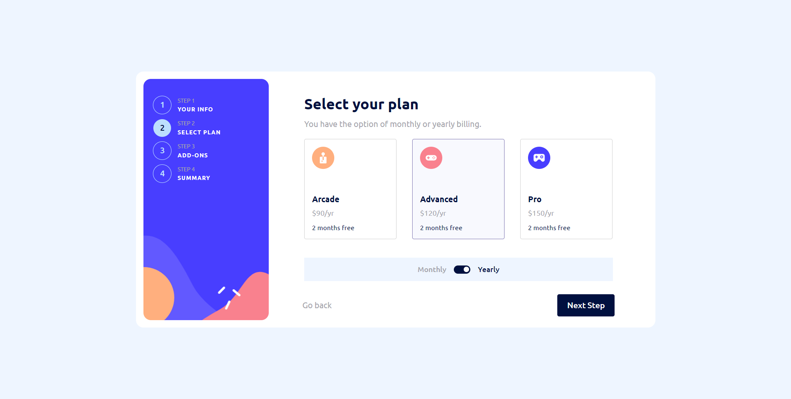

# Frontend Mentor - Multi-step form solution

This is a solution to the [Multi-step form challenge on Frontend Mentor](https://www.frontendmentor.io/challenges/multistep-form-YVAnSdqQBJ). Frontend Mentor challenges help you improve your coding skills by building realistic projects.

## Table of contents

- [Overview](#overview)
  - [The challenge](#the-challenge)
  - [Screenshot](#screenshot)
  - [Links](#links)
- [My process](#my-process)
  - [Built with](#built-with)
  - [What I learned](#what-i-learned)
  - [Continued development](#continued-development)
  - [Useful resources](#useful-resources)
- [Author](#author)

## Overview

### The challenge

Users should be able to:

- Complete each step of the sequence
- Go back to a previous step to update their selections
- See a summary of their selections on the final step and confirm their order
- View the optimal layout for the interface depending on their device's screen size
- See hover and focus states for all interactive elements on the page
- Receive form validation messages if:
  - A field has been missed
  - The email address is not formatted correctly
  - A step is submitted, but no selection has been made

### Screenshot

### Links

- Solution URL: [Solution](https://github.com/AdrianMaj/MultiStepForm)
- Live Site URL: [Live Site](https://reactmultistepform1.netlify.app/)

## My process

### Built with

- [React](https://reactjs.org/) - JS library
- [React Redux](https://react-redux.js.org/) - React Library
- [React Router](https://reactrouter.com/en/main) - React Library
- [Framer Motion](https://www.framer.com/motion/) - React Animation Library
- [TypeScript](https://www.typescriptlang.org/) - JavaScript superset language
- [Sass](https://www.typescriptlang.org/) - CSS superset language
- Mobile-first workflow

### What I learned

During this project, I gained a tremendous amount of experience working with React and its libraries. I also learned how to combine React with TypeScript in practice, so that everything works and is typed correctly. I also learned about Framer Motion and how it is used in projects to provide smooth, natural animations. I believe that this project solidified my knowledge that I gained in the course "React - The Complete Guide 2023" from Academind.

### Continued development

After this project, I would like to start learning the Next.JS Framework, and then create a large full-stack application based just on this framework, with UI/UX design prepared by me.

### Useful resources

- [Framer Motion layout animations](https://www.framer.com/motion/layout-animations/) - Here I learned a lot about layout animation in Framer Motion, and it helped me understand how it works.

## Author

- Website - [Mayestic.pl](https://mayestic.pl/)
- Frontend Mentor - [@AdrianMaj](https://www.frontendmentor.io/profile/AdrianMaj)
- Twitter/X - [@adrianmaj1122](https://twitter.com/adrianmaj1122)
